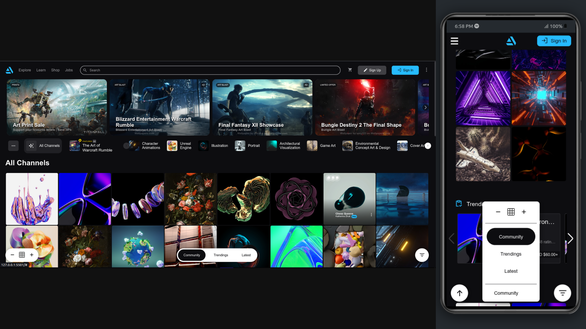

# Artstation Clone

## Preview

## Overview

Artstation Clone is a project designed to enhance my frontend development skills by creating a fully functional clone of the Artstation landing page. This project showcases my ability to handle complex layouts, responsive design, and interactive UI widgets. All features, including dropdowns, sliders, and grid layouts, are implemented using pure HTML, Sass, and JavaScript.

## Technologies Used

**Languages:**

- **HTML5**: For structuring semantic and accessible markup.
- **Sass/CSS**: For styling the page with a focus on modularity and reusability.
- **JavaScript**: To manage functionalities and UI manipulations.

**Tools:**

- **Gulp**: Utilized for compiling Sass files.

## Features

- **Fully Responsive Design**: Optimized for all devices, including mobile and desktop.

- **Modular Sass/CSS**: Leveraging the power of Sass to create a robust and clean stylesheet that can be easily extended or reused in future projects.

- **Component-Based Styling**: Includes reusable styling rules for various components such as:
  - Icon
  - Badge
  - Button
  - Dropdown
  - Divider

- **Hover Dropdowns**: Mimics Artstation's navigation experience, where dropdown menus appear on hover with an underline focus effect.

- **Mobile Menu**: A dedicated mobile menu that opens upon tapping the hamburger icon, ensuring a smooth user experience akin to the original Artstation menu.

- **Quick Results in Search Input**: Displays quick search results below the input field when focused, enhancing usability.

- **Gallery Scrollers**: Implements snappy scrollers/carousels using pure HTML/CSS/JS without any libraries to reinforce foundational skills:
  - **Desktop**: Snapping functionality is achieved through JavaScript.
  - **Mobile**: Utilizes CSS scroll-snap rules for an intuitive touch experience.

- **Sticky Channels Section**: Features a sticky section on desktop that contains all content, including carousel sliders and menus, similar to the Artstation layout.

- **Artworks Grid**: Built with CSS Grid and controlled via JavaScript, allowing users to adjust the size of grid items using plus/minus buttons located in the bottom navbar.

- **Dynamic Grid Sizes**: Users can modify the dimensions of artwork grid items interactively through controls.

- **Smooth Transitions for Artwork Posts**: Each artwork post reveals additional information (artist name, category, etc.) with a smooth CSS transition on hover, closely resembling Artstation's functionality.

- **Trending Posts Section**: A responsive carousel-slider that snaps during mouse or touch dragging, implemented using both JS and CSS for enhanced interactivity.

## Future Enhancements

Additional pages and features may be added in future iterations to further enrich the user experience and expand functionality.

For more details or to view the live demo, please visit the [GitHub repository](https://github.com/parsa-farahani/Artstation-landingpage-clone-deployment/).

## Contact Information

For inquiries or feedback, please reach out via email at [aiparsa83@gmail.com](mailto:aiparsa83@gmail.com) or connect on [LinkedIn](https://www.linkedin.com/in/parsa-farahani-935195293).